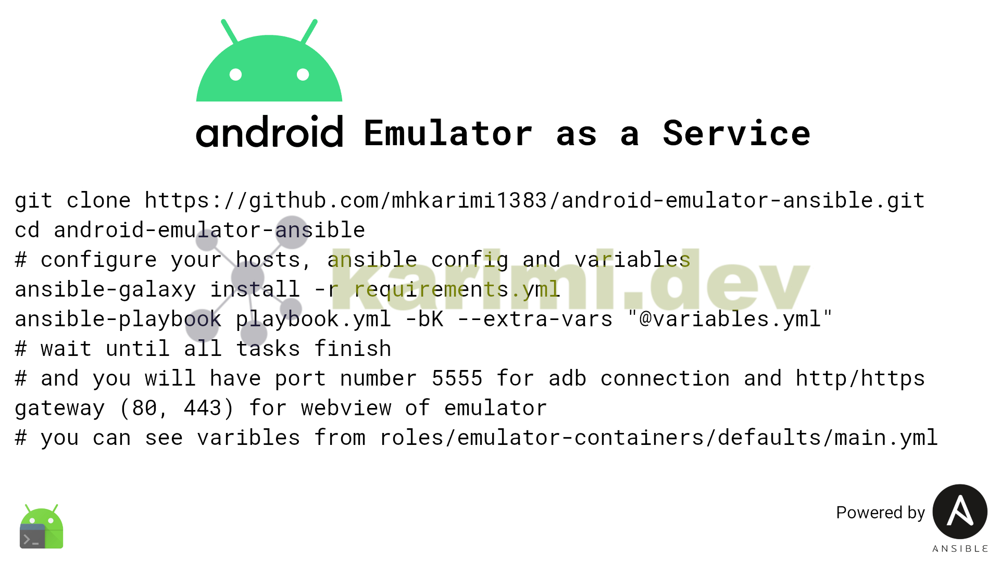

# Android Emulator server ansible role

> if you want details refer to my [blog](https://karimi.dev/posts/android-emulator-as-a-service/)

installing Android Emulator service and related needed things using ansible

it will give you port number 5555 for adb connection
and http/https gateway (80, 443) for webview of emulator

before running it create you inventory file
and checkout variables

to get collections and roles that are used run

```bash
ansible-galaxy install -r ./requirements.yml
```

> to make sure it will successfully work change you ssh connection time to a higher value (images are heavy)
